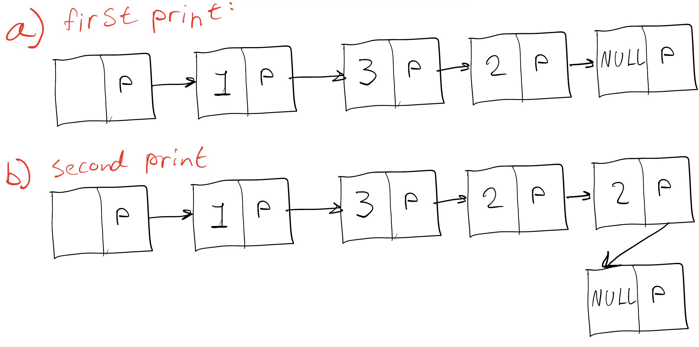

# Assignment 6

## 1
As seen in the step by step walkthrough in the image below the code, it will return "x=7, y=18, z=2"

```c
int x;
int y;
int z;
int* w;
int* q;
x = 0;
y = 1;
z = 2;
w = &x;
q = &y;
*w = y;
*q = z;
*w = x + y + z + *q;
*q = x + y + z + *w;
printf("x=%d, y=%d, z=%d\n", x, y, z);
```


## 2
See max.c for code answer.

## 3
### a


### b
See list.c for code answer. 

### c
The code loops infinitely and only prints out the value of the second element of the list. This happens since it never goes to the next element inside the loop.

### d
Since everything else is correct and it only needs to go through the rest of the elements, so you just have to add that singular extra line. The correction can be seen in list.c. As seen in the code an assertion is also added similarly to the add function, but it isn't necessary for it to be functional.

### e
See list.c for code answer.

## Challenge
