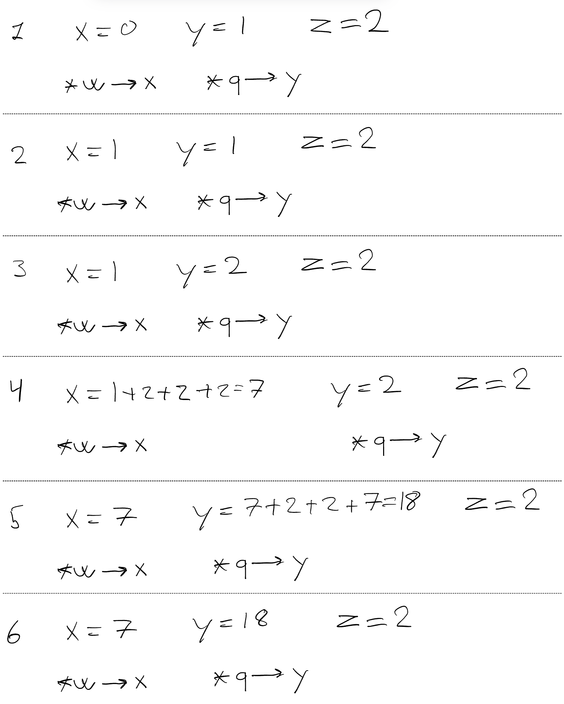

# Assignment 6

## 1
As seen in the step by step walkthrough in the image below the code, it will return "x=7, y=18, z=2"

```c
int x;
int y;
int z;
int* w;
int* q;
x = 0;
y = 1;
z = 2;
w = &x;
q = &y;
*w = y;
*q = z;
*w = x + y + z + *q;
*q = x + y + z + *w;
printf("x=%d, y=%d, z=%d\n", x, y, z);
```



## 2
See max.c for code answer.